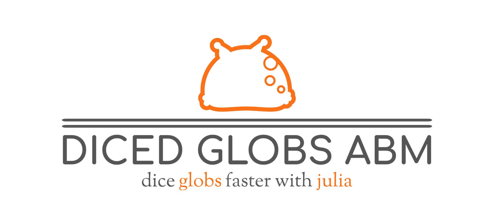

# DiCED-GlobS-ABM

Distributed Concurrent Event Driven Global Scale Agent Based Model in Julia

citation: Tulchinsky, A. Y., Haghpanah, F., Hamilton, A., Kipshidze, N., & Klein, E. Y. (2024). Generating geographically and economically realistic large-scale synthetic contact networks: A general method using publicly available data (arXiv:2406.14698). arXiv. http://arxiv.org/abs/2406.14698
